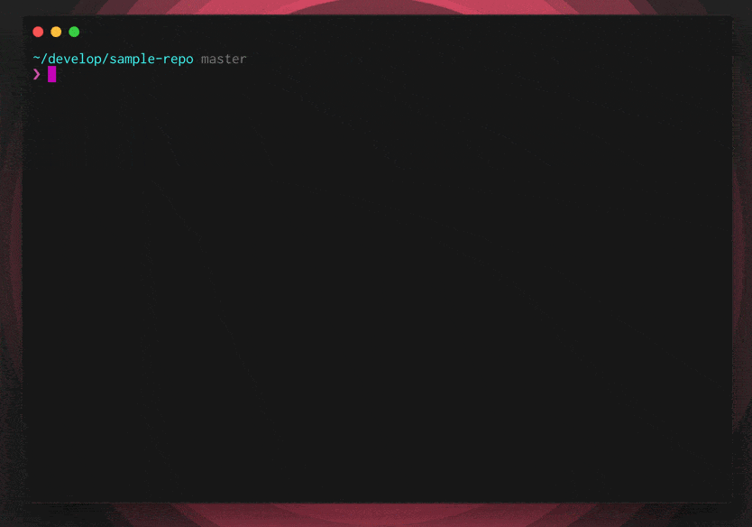

# git-prout

[](https://travis-ci.org/tsuyoshiwada/git-prout)
[](https://github.com/tsuyoshiwada/git-prout/releases)
[](https://github.com/tsuyoshiwada/git-prout/blob/master/LICENSE)

> `git-prout` is a CLI tool using Golang. You can easily checkout GitHub Pull Request locally.


## Table of Contents

- [Demo](#demo)
- [Install](#install)
- [Usage](#usage)
- [Contribute](#contribute)
- [License](#license)


## Demo




## Install

### Homebrew

```bash
$ brew tap tsuyoshiwada/git-prout
$ brew install git-prout
```

If you are in another platform, you can download binary from [release page](todo) and place it in `$PATH` directory.

### Golang

Or you can use `go get`.

```bash
$ go get -u github.com/tsuyoshiwada/git-prout
```


## Usage

```bash
$ git-prout [<flags>] <number>

Flags:
  -h, --help             Show context-sensitive help (also try --help-long and --help-man).
      --debug            Enable debug mode.
  -r, --remote="origin"  Reference of remote.
  -f, --force            Force execute pull or checkout.
  -q, --quiet            Silencey any progress and errors.
      --version          Show application version.

Args:
  <number>  ID number of pull request

```


### Tips

You can execute `git-prout` as a git subcommand.

```bash
$ git prout 123
```


## Contribute

1. Fork (https://github.com/tsuyoshiwada/git-prout)
1. Create a feature branch
1. Commit your changes
1. Rebase your local changes against the master branch
1. Run test suite with the `go test` command and confirm that it passes
1. Create new Pull Request :)

Bugs, feature requests and comments are more than welcome in the [issues](https://github.com/tsuyoshiwada/git-prout/issues).


## License

[MIT © tsuyoshiwada](./LICENSE)
